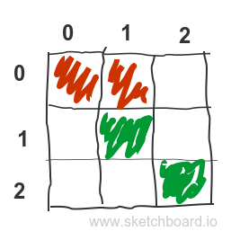
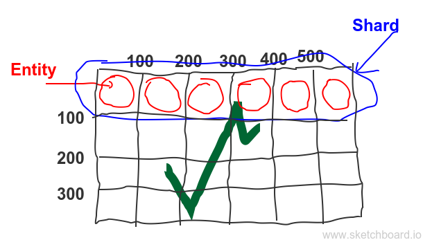
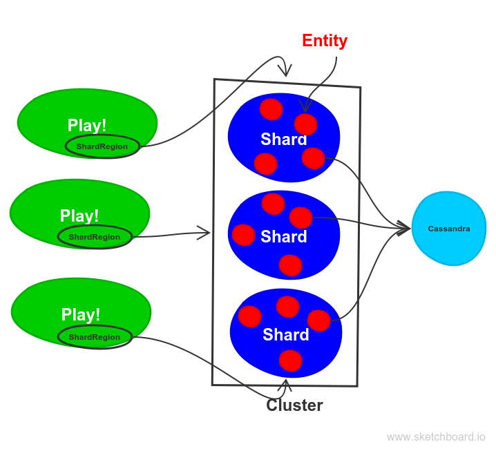

*AkkaPaint* - simplicity and power of Akka
==============

Introduction
-------------


*Once upon a time, there was an idea of a [complete chaos](http://chaos.drawball.com/),*  
*where you could express and instantly share anything you care about.*  
*However, the days of Adobe Flash are long gone,*  
*so the new idea was born:*  
*make the chaos great again!*   
*And this is how from chaos arose [AkkaPaint](https://github.com/liosedhel/akkapaint)*   


The idea was pretty straightforward - create a drawing space, which will be:
* multiuser,
* able to propagate changes to all users in real time,
* scalable.

You may ask, where is the challenge? The answer is: make the implementation really small and simple.

Drawing board representation - basics
-------------
Drawing board can be represented as a simple map between pixel coordinates and color representation of that pixel. It’s really naive approach, which doesn't include any optimizations, but it's working surprisingly well. Furthermore, every change on the drawing board can be represented as an event, which contains pixel sequence and a new color applied for this pixels.



```scala
case class Pixel(x: Int, y: Int)

case class DrawEvent(
    pixels: Seq[Pixel],
    color:   Color
)

//Board state
type Color = String
var akkaPaintBoard = Map.empty[Pixel, Color]
```


Drawing board as an actor
-------------
For me,  [Akka Toolkit](http://akka.io/) seems to be a perfect fit for this problem. The painting board can be easily represented as an Actor. Internal actor state can contains a map where pixels are keys and colors are values (`akkaPaintBoard: Map[Pixel, Color]`). As we want to preserve the actor state between application restarts, we will use [Persistent Actor](http://doc.akka.io/docs/akka/current/scala/persistence.html) here. Every change to the board will be saved as an event. Sounds great!

```scala
class AkkaPaintActorSimple() extends PersistentActor {

  var akkaPaintBoard = Map.empty[Pixel, String]

  override def persistenceId: String = "drawballActor"

  override def receiveRecover: Receive = {
    case d: DrawEvent => updateState(d)
  }

  override def receiveCommand: Receive = {
    case Draw(changes, color) =>
      persistAsync(DrawEvent(changes, color)) { de =>
        updateState(de)
      }
  }

  private def updateState(drawEvent: DrawEvent) = {
    akkaPaintBoard = drawEvent.changes.foldLeft(akkaPaintBoard) {
      case (newAkkaPaintBoard, pixel) =>
        newAkkaPaintBoard.updated(pixel, drawEvent.color)
    }
  }

}
```

Scalable drawing board
-------------
The size of a drawing board can be enormous, what implies a lot of pixels to be processed and a lot of changes to be applied. Sadly, that's too much for one actor. So let's split the whole board into small squares 100x100 pixels each. Such square can be represented by one actor, and will hold the colors only of 10000 pixels. Ideally, we want to scale the problem horizontally, as sometimes whole board can't fit into one machine's memory, or we want to use computing power of more machines. And here comes [Akka Cluster Sharding](http://doc.akka.io/docs/akka/current/scala/cluster-sharding.html)! The [idea](http://doc.akka.io/docs/akka/current/scala/cluster-sharding.html#How_it_works) is simple: actors (here called entities) are forming shards (shard is simply a group of actors), and each of the shards can be located on a different machine. Furthermore, there is a concept of coordinator, which knows the location of each shard and each entity. The shard ID and entity ID are extracted from incoming data using two simple functions presented below (`extractShardId` and `extractEntityId`) . The `shardingPixels` method is responsible for splitting an incoming stream of pixel color changes into smaller packages addressed to exactly one entity.

```scala
val entitySize = 100

def shardingPixels(changes: Iterable[Pixel], color: Color): Iterable[DrawEntity] = {
      changes.groupBy { pixel =>
        (pixel.y / entitySize, pixel.x / entitySize)
      }.map {
        case ((shardId, entityId), pixels) =>
          DrawEntity(shardId, entityId, pixels, color)
      }
}

private val extractEntityId: ShardRegion.ExtractEntityId = {
    case DrawEntity(_, entityId, pixels, color) ⇒
      (entityId.toString, Draw(pixels, color))
}

private val extractShardId: ShardRegion.ExtractShardId = {
    case DrawEntity(shardId, _, _, _) ⇒
      shardId.toString
}
```

This solution is illustrated here:



Creating a cluster and obtaining the `ShardRegion` reference (`ShardRegion` is a local actor representing the entrance to the cluster) can look like this:

```scala
 def initializeClusterSharding(actorSystemConf: Config): ActorSystem = {
    
    val system = ActorSystem("AkkaPaintSystem", actorSystemConf)

    ClusterSharding(system).start(
      typeName = regionName,
      entityProps = Props[AkkaPaintActor],
      settings = ClusterShardingSettings(system),
      extractEntityId = extractEntityId,
      extractShardId = extractShardId
    )
    system
  }

  def shardRegion()(implicit actorSystem: ActorSystem): ActorRef = {
    ClusterSharding(actorSystem).shardRegion(regionName)
  }
```  
We can send all messages to the `ShardRegion`, which knows (thanks to the coordinator) how to route messages to the proper entity. Also it is worth to mention that if new machine joins the cluster, some of the shards will be moved to that machine (look at `least-shard-allocation-strategy` configuration). This process is called `resharding` and is performed in few steps:

1. The shard that will be moved to another machine is chosen by the coordinator.
2. Coordinator informs `ShardRegion` to start buffering all messages that are incoming to this shard.
3. All of the actors inside the chosen shard are killed.
4. Shard and actors are started on a new machine (the state of the actor will be restored from the events that were previously persisted in a database).
5. All buffered data is sent to the newly restored shard.

Perceptive reader will surely notice here a potential inconvenience - with a lot of incoming messages during the resharding process, the buffer can overflow. Sadly, all you can do is to resize the buffer by setting `akka.cluster.sharding.buffer-size` configuration parameter.

A current state of the board persists even after changing the size of it in the code. Shards and entities will be dynamically created at runtime in case of board resizing.  

Multiple users
-------------

To keep all active users updated we can use WebSockets. In Play! framework each WebSocket connection can be represented as an actor (yay, what a surprise :)). This `ClientConnectionActor` can be registered in each entity, and each entity can send the updates completely asynchronously to the browser via `ClientConnectionActor` reference.

```scala

class ClientConnectionActor(
  browser: ActorRef,
  shardRegion: ActorRef
  height: Int,
  width: Int
) extends Actor {

  val entitySize = 100

  registerToAll(self).foreach(shardRegion ! _)
  var recentChanges = Map.empty[Pixel, String]

  override def receive: Receive = {
    case d: Draw =>
      shardingPixels(d.pixels, d.color).foreach(shardRegion ! _)
    case c @ Changes =>
      browser ! c
  }

  override def postStop(): Unit = {
    unregisterFromAll(self).foreach(shardRegion ! _)
  }
  
  def registerToAll(self: ActorRef): Iterable[ShardingRegister] = {
      for {
        shardId <- 0 until (height / entitySize)
        entityId <- 0 until (width / entitySize)
      } yield ShardingRegister(shardId, entityId, self)
    }
}
//Play! controller
def socket = WebSocket.accept[Draw, Changes](requestHeader => {
    ActorFlow.actorRef[Draw, Changes](browser =>
      ClientConnectionActor.props(
        browser,
        drawballActor, 1600, 800
      ))
})
```
And now all we need is "just" a few lines of JavaScript, HTML and CSS and everything is up and running.

Total scalability of the *AkkaPaint*
-------------

The application consists of 3 main parts:

1. Play! web application (serving static data, parsing json messages incoming via WebSocket, converting to json and pushing messages to the client browser)
2. Akka Cluster Sharding (updating internal actor state (saving events and snapshots), sending changes to all registered clients) 
3. Cassandra database (saving events and snapshots stream, serving events and snapshots during cluster restart and resharding process)

Each of this parts can be easily scaled horizontally.



Try it on your own!
-------------

* Install and run [Cassandra](http://cassandra.apache.org/) database
* Clone the project: [akkapaint](https://github.com/liosedhel/akkapaint)
* Type `sbt run`
* Go to the browser address: [http://localhost:9000/demo](http://localhost:9000/demo) and express yourself by drawing whatever you want to! 

In case you don't want to download anything you can try it online here: [http://demo.akkapaint.org/](http://demo.akkapaint.org/). Maybe drop your country's flag there?
 
Furthermore, you can lend your computer resources. If you want to join the cluster, find the `akkapaint-web.conf` file and apply the `if you want to join me` comments actions. Restart your application and voilà - in 10 seconds part of the shards should be moved to your machine (you should see some logging on your console).

Summary
-------------

We have walked through the general idea, and practical examples of some extraordinary *Akka* features (like persistent actors, clustering, sharding) which allowed us to build a multiuser, scalable *AkkaPaint* with possibility to get the updates in the real time. The current working implementation has only 288 LOC! *Akka* really shines here. There is a lot more things I've implemented, such as:

* snapshoting
* performance optimizations (e.g. messages serialized via [Protocol Buffer](https://developers.google.com/protocol-buffers/) 
* buffering messages (the updates to the browser are sent with 1s tick)
* adjusting play configuration
* adjusting akka sharding configuration
* preparing some gatling tests
* painting images on *AkkaPaint* board, with the great help of [akka-stream](http://doc.akka.io/docs/akka/2.4.10/scala/stream/index.html) and [rapture.io](rapture.io) json library. 

I am not able to describe everything in this blog post, as the text is already too long.
All those features can be found here: [akkapaint](https://github.com/liosedhel/akkapaint). There are a lot of great ideas to be implemented (e.g. creating private boards, some compression and further performance optimizations, loading images through the browser, UI improvements...). All contributions are really welcome! 

Happy hAkking!
