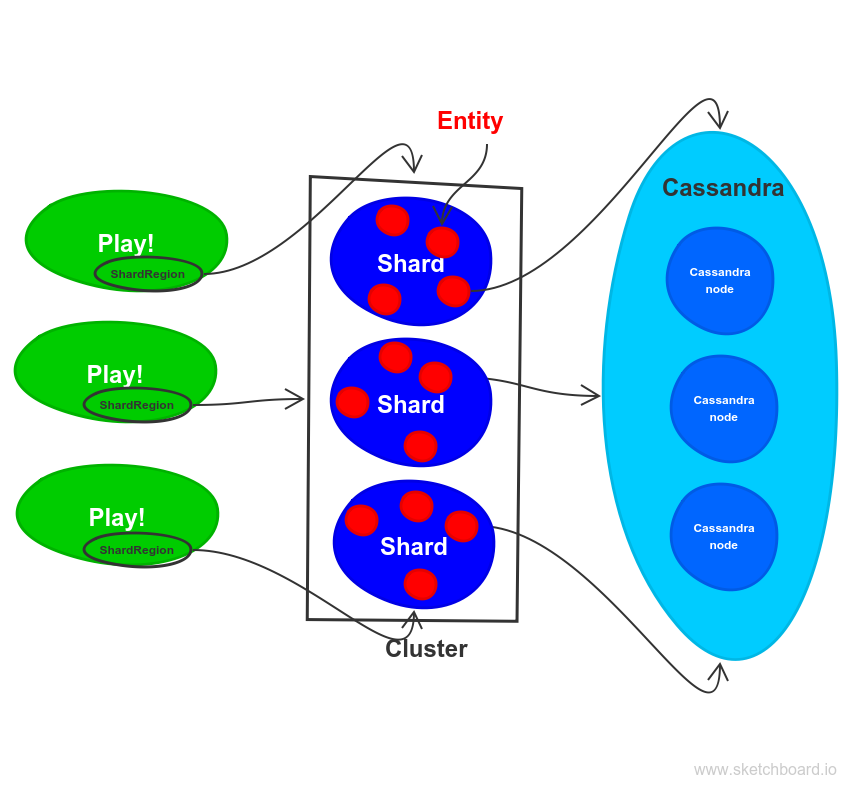

*AkkaPaint* - simplicity and power of Akka
==============

Introduction
-------------
Once upon a time, there was an idea of [complete chaos](http://chaos.drawball.com/), where you could express and instantly share everything you care. However, the time of *Adobe Flash* is long gone, so the new idea was born: make the *chaos* great again! And that is how from chaos arose *AkkaPaint*.

The idea was pretty straightforward - create a drawing space, which will be:
* multiuser,
* able to propagate changes to all user in real time,
* and scalable.

You may ask, where is the challenge? The answer is: make the implementation really small and simple.

Drawing board representation - basics
-------------
Drawing board can be represented as a simple map between pixel coordinates and color representation of that pixel. It’s really naive approach, without any optimizations, but let’s find out how it works. Furthermore, every change on the drawing board can be represented as an event, which contains pixel sequence and new color applied for this pixels.


```scala
case class Pixel(x: Int, y: Int)

case class DrawEvent(
    pixels: Seq[Pixel],
    color:   String
)

//Board state
type Color = String
var drawballBoard = Map.empty[Pixel, Color]
```


Drawing board as an actor
-------------
For me, the whole problem sounds like something perfect for the [Akka Toolkit](http://akka.io/). The painting board can be easily represented as an Actor. Internal actor state can contains the pixel to color map (`akkaPaintBoard: Map[Pixel, Color]`). As we want to preserve the actor state between application restart, we will use [Persistent Actor](http://doc.akka.io/docs/akka/current/scala/persistence.html) here. Every change to the board will be saved as an event. Sounds great!

```scala
class AkkaPaintActorSimple() extends PersistentActor {

  var akkaPaintBoard = Map.empty[Pixel, String]

  override def persistenceId: String = "drawballActor"

  override def receiveRecover: Receive = {
    case d: DrawEvent => updateState(d)
  }

  override def receiveCommand: Receive = {
    case Draw(changes, color) =>
      persistAsync(DrawEvent(changes, color)) { de =>
        updateState(de)
      }
  }

  private def updateState(drawEvent: DrawEvent) = {
    akkaPaintBoard = drawEvent.changes.foldLeft(akkaPaintBoard) {
      case (newAkkaPaintBoard, pixel) =>
        newAkkaPaintBoard.updated(pixel, drawEvent.color)
    }
  }

}
```

Scalable Draw Board
-------------
The draw board size can be really big, what imply a lot of pixels to process, a lot of changes to apply. Sadly, too much for one actor. So let's split whole sheet to the small squares - e.g. 100x100 px each. Such square can be represented by one actor, and will hold only the color of 10000 pixels. Ideally, we want them to scale also horizontally, as sometimes whole board can't fit into one machine memory, or we want to use computing power of other machines. And here comes [Akka Cluster Sharding](http://doc.akka.io/docs/akka/current/scala/cluster-sharding.html)! The [idea](http://doc.akka.io/docs/akka/current/scala/cluster-sharding.html#How_it_works) is simple: actors (here called entities) are formed into shards (shard is simply a group of actors), and each shard can be located on different machine. Above all this, there is exactly one coordinator, which knows the location of each shard and each entity. The shard ID and entity ID is extracted based on incoming data, with the use of two simple functions presented below (`extractShardId` and `extractEntityId`) . The `shardingPixels` method is responsible for splitting incoming stream of pixel color changes into smaller packages addressed for exactly one entity.

```scala
def shardingPixels(changes: Iterable[Pixel], color: String): Iterable[DrawEntity] = {
      changes.groupBy { pixel =>
        (pixel.y / 100, pixel.x / 100)
      }.map {
        case ((shardId, entityId), pixels) =>
          DrawEntity(shardId, entityId, pixels, color)
      }
}

private val extractEntityId: ShardRegion.ExtractEntityId = {
    case DrawEntity(_, entityId, pixels, color) ⇒
      (entityId.toString, Draw(pixels, color))
}

private val extractShardId: ShardRegion.ExtractShardId = {
    case DrawEntity(shardId, _, _, _) ⇒
      shardId.toString
}
```

What is illustrated here:


Creating cluster and obtaining `ShardRegion` reference (`ShardRegion` is an local actor representing the entrance to the cluster) can look like this:

```scala
 def initializeClusterSharding(actorSystemConf: Config): ActorSystem = {
    
    val system = ActorSystem("AkkaPaintSystem", actorSystemConf)

    ClusterSharding(system).start(
      typeName = regionName,
      entityProps = Props[AkkaPaintActor],
      settings = ClusterShardingSettings(system),
      extractEntityId = extractEntityId,
      extractShardId = extractShardId
    )
    system
  }

  def shardRegion()(implicit actorSystem: ActorSystem): ActorRef = {
    ClusterSharding(actorSystem).shardRegion(regionName)
  }
```  
We can send all messages to the `ShardRegion`, which knows (thanks to the Coordinator) how to route messages to the proper entity. Also worth to mention: if new machine joins the cluster, some of the shards will be moved to that machine (look at `least-shard-allocation-strategy` configuration). Resharding process is done in few steps:

1. The shard that will be moved to another machine is chosen by coordinator.
2. Coordinator inform `ShardRegion` to start buffering all messages that are incoming to this shard.
3. All the actors inside the chosen shard are killed.
4. Shard and actors are started on new machine (the state of the actor will be restored from the persisted previously in database events).
5. All buffered data are send to the newly restored shard.

Perceptive reader surely see here potential inconvenience - with a lot of incoming messages during resharding process, the buffer can be overflowed. Sadly, all you are able to do is resizing the buffer by setting `akka.cluster.sharding.buffer-size` configuration parameter.

The board size can be easily changed without any current data loss (for now by changing some hardcoded variables in the project). Shards and entities will be dynamically created at runtime in case of board resizing.  

Horizontal scaling is possible on 3 different levels:

1. Play! web application (serving static data, parsing json messages incoming through WebSocket, converting to json and pushing messages to the client browser)
2. Akka Cluster Sharding (updating internal actor state (saving events and snapshots), sending changes to all registered clients) 
3. Cassandra database (saving events and snapshots stream, serving events and snapshots during cluster restart and resharding process)



Multiple users
-------------

To keep all active users updated we can use WebSockets. In Play! framework each WebSocket connection can be represented as an actor (yay, what a surprise :)). This `ClientConnectionActor` can be registered in each entity, and each entity can send the updates completely asynchronously to the browser via `ClientConnectionActor` reference.

```scala

class ClientConnectionActor(
  browser: ActorRef,
  shardRegion: ActorRef
  height: Int,
  width: Int
) extends Actor {

  registerToAll(self).foreach(shardRegion ! _)
  var recentChanges = Map.empty[Pixel, String]

  override def receive: Receive = {
    case d: Draw =>
      shardingPixels(d.pixels, d.color).foreach(shardRegion ! _)
    case c @ Changes =>
      browser ! c
  }

  override def postStop(): Unit = {
    unregisterFromAll(self).foreach(shardRegion ! _)
  }
  
  def registerToAll(self: ActorRef): Iterable[ShardingRegister] = {
      for {
        shardId <- 0 until (height / 100)
        entityId <- 0 until (width / 100)
      } yield ShardingRegister(shardId, entityId, self)
    }
}
//Play! controller
def socket = WebSocket.accept[Draw, Changes](requestHeader => {
    ActorFlow.actorRef[Draw, Changes](browser =>
      ClientConnectionActor.props(
        browser,
        drawballActor, 1600, 800
      ))
})
```
And know all we need is "just" a few lines of JavaScript, HTML and CSS and everything is up and running.

Try it on your own!
-------------

* Install and run [Cassandra](http://cassandra.apache.org/) database
* Clone the project: [akkapaint](https://github.com/liosedhel/akkapaint)
* Type `sbt run`
* Go to the browser address: [http://localhost:9000/demo](http://localhost:9000/demo) and express yourself drawing what you want! 

Or you can try it online here: [http://demo.akkapaint.org/](http://demo.akkapaint.org/). Maybe drop there your country flag?
 
Furthermore, you can borrow your computer resources :). If you want to join the cluster, find the `akkapaint-web.conf` file and apply the `if you want to join me` comments actions. Restart your application and voilà - in 10 seconds part of the shards should be moved to your machine (you should see some logging on your console).

Summary
-------------

We have walked through the general idea, and practical examples of some extraordinary *Akka* features (like persistent actors, clustering, sharding) that allowed us to build multiuser, scalable *AkkaPaint* with enabled real time changes. Current working implementation has only 288 LOC! *Akka* really shines here. There is a lot more things I've implemented, such as:

* snapshoting
* performance optimizations (e.g. messages serialized via [Protocol Buffer](https://developers.google.com/protocol-buffers/) 
* buffering messages (the updates to the browser are sent with 1s tick)
* adjusting play configuration
* adjusting akka sharding configuration
* preparing some gatling tests
* painting images on *AkkaPaint* board, with the great help of [akka-stream](http://doc.akka.io/docs/akka/2.4.10/scala/stream/index.html) and [rapture.io](rapture.io) json library. 

I am not able to describe everything in this blog post, as already this text is way too long :)
All this features and more you can find here: [akkapaint](https.github.com/liosedhel/akkapaint). There is a lot of great ideas possible to implement (e.g. creating private boards, some compression and further performance optimizations, loading images through the browser, UI improvements...). All contributions really welcome! 

Happy hAkking!
