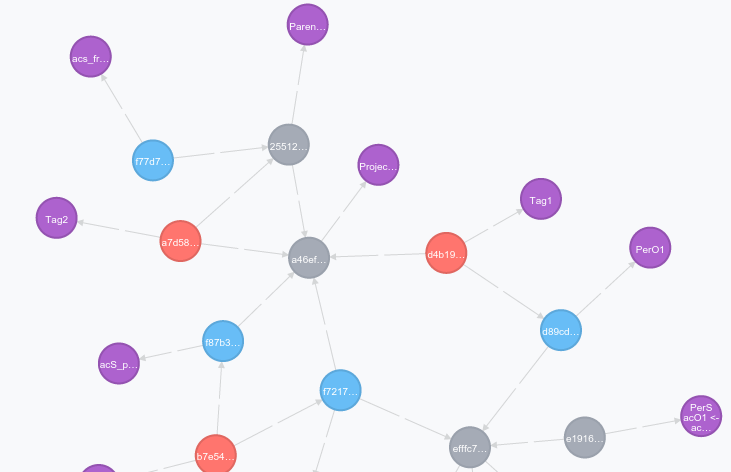
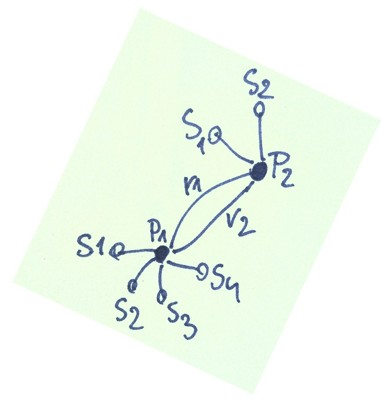

# Immutable graphs with Neo4j

## Problem:

Imagine you have to manage hundreds of different projects, that could have several different actions or building blocks. These projects can be grouped into "monitoring groups" - and you have some people assigned to execute them, some others are assigned to monitor them. You have "cost centers", progress and performance measures and all this related management things on top. It has to be generic enough to cover different types of businesses, yet all of them need to manage projects.

This is the kind of sophisticated tool used by some of the large CAC-40 (Euronext Paris) listed companies that we were working on. This software stack was going through a lot of transformations and rapid development to cover new functionality and get more generic architecture.

### Asynchronous graphs with actors

To get speed and flexibility, it was rewritten to Scala and Akka with relational database as a persistence layer and more and more data processing was done in application code.

The data flow was looking like this:
```
[ simple storage ] -- [ merge/split <=> data <=> graph-query engine <=> json/REST API ] -- [ UI / Angular ]
```

While this is a usual path when scaling out - downgrade database to simple key-value storage and take data processing to better distributed application nodes - it also moves a lot of complexity to business layer, in the same time taking off visibility and consistency checks of business data from storage. While Scala is almost a perfect language for middle tiers, it doesn't solve complexity problems related to doing everything in "our" code, "by hands".

Having such a simple storage means you can't just browse, query or "check" that data like in a typical SQL or NoSQL document database. If you need any ad-hoc business analytics/inteligence, it has to be done in application layer. There is a reason why business loves SQL and SQL-related technologies and it is the simplicity of exploring existing data. Here all new queries have to be coded as APIs, in the same time it just increases bug-fixing and maintenance costs.

There was also another wish from the client -- go immutable with all changes to allow queries and comparisons in time. That was something the existing model was not prepared for. While improving it to have "undo" values was an easy step, adding "undo relations" would mean a snapshot of the whole structure every time such change occurred. That way in few weeks we would have to manage hundreds of DB "snapshots", available for querying. A complete no-go without having a dedicated Dev/Ops team, even then handling several different databases wouldn't be easy and cost-effective.

## Perhaps we should try graph database?

First phase was to evaluate how such data can be expressed in a more usable form. At that time there were 2-3 viable graph database options available on the market (OrientDB and perhaps Titan), but after some checking and knowing we have quite constrained budget in terms of possible project risk/failure, we decided to go prototyping only with Neo4j. It was the most mature solution for this type of data and size, with good coverage in language drivers/api and doc, active community and ok licensing (the same like e.g. MongoDB). The Cypher query language used by Neo4j is similar to SQL but covers functionality for connected data points. All that was a promise for a project with acceptable risks levels that can bring new, desired features. We already had some previous experience with Neo4j, so it was easy to start with.

### How to model your data - how do you query your data?

The important thing about modelling your graph data in Neo4j is about getting the model right. You are not going to get it for the first time, as what you really need in terms of database structure, you will see when you translate existing queries into Cypher (Neo graph SQL) or db-api calls and execute them, getting some benchmark numbers. This is more like a quick prototype-check-fix cycle

```
[ key-val storage ] --> converter --> [ graph model ] <--> validate with Cypher graph queries
```

A small ETL in Ruby/Neography helped a lot with quick changes on how the data model should be transformed from SQL and stored in Neo4j. That way also some per-client customisations existing in old SQL model could be cleaned and translated to more flexible, general graph model, not polluting new Scala middle-tier logic.

Neo4j comes with a handy command-line and a nice web data browser, so you can easily visualise what you have:



### Cypher - graph query language

In general, graphs have "nodes" or "vertices", connected by relations or edges. A single node in Neo4j could be like a small table in SQL world, having its own fields with values.

Cypher - the [graph query language used in Neo4j http://neo4j.com/developer/cypher-query-language/], can describe what you want to select in terms on nodes and connections between them. The basic syntax is actually quite simple and natural.

Imagine you have two nodes, a project with some action to be done

```
(project)-[:connection]->(action)
```

To get it, we can write a query similar to SQL:

```
MATCH (project)-[:connection]->(action)
WHERE project.name="Innovation" and action.name="Wireless-enabled fridge"
RETURN project, action
```

There may be actually someone working on it:

```
(project)-[:connection]->(action)<-[:working]-(person)
```

This action can belong in the same time to some "wireless R&and;D" cost centre, while project is managed by some PM:

```
(person {title: "PM"})-[:managing]->(project)-[:connection]->(action)<-[:working]-(person)
                    (cost_centre {name: "Wireless"})-[:has]->(action)
```
This is written in two lines, but when visualised, we would have this single "action" node in the centre of our picture.

## Let's complicate it: lambda-like architecture for time-machine with immutable data

Our graph can represent graph of connections and advancement of executed projects for the current moment of time, "now". We already had a functionality to keep previous changes of node values, like an action.name, but we didn't have anything to keep track when our action moves to another project. We needed an architecture to cover immutability of the whole data structure. We may ask "how our projects and assignements were looking like 3 months ago", or "who moved that project and did we save more than 10% of global R&and;D costs"? Or perhaps we just want so do some aggregation over periods of time to see how the progress has been going on. 

The answer was to separate mutable changes from immutable "cores", time-stamping all the changes - where the change of data is both a change in node properties and connections between them.

This idea could be expressed in a model like this:



P1 and P2 are "immutable cores of data entities". P1 got 4 changes, so they are stored as a sequence of states S1-S4. P2 got two changes S1-S2. At some point of time the properties of relation r1 connecting P1 and P2 have changed, creating another relation r2.

Of course, there are more answers to how to store time-dependent data - it is worth to do (your own research|https://www.google.com/search?q=neo4j+with+time+dependent+data), there are many other examples.

### Modelling back: Indexing and constraints

Some of the questions that we needed to consider while modeling new structures were - how are we going to use this data, query it, how database can help us to keep it healthy, unique and quick to find? Neo4j has indexes that work on node data - they take node label and node property and can be constrained as a pair of unique values - similar to what we know from SQL databases:

```
CREATE CONSTRAINT ON (n:Node) ASSERT n.UUID IS UNIQUE
```

There are also "legacy" indexes, configured in 
```
conf/neo4j.properties
```
(or with the Java API), a bit lower-level and closer to background Lucene engine, that give us possibility to index practically any property in a graph, even do a full-text indexing. Just by using a proper indexing scheme on our data we could reduce query times 10-fold. With newer versions of Neo4j, there also comes profiler and query-explain syntax to see how possibly a query can be optimised and/or indexing improved.

## Delivering new Scala API

The software stack was split into separate parts, with UI written in Html5/JS/Angular and backend APIs written in Scala/Play/Akka. The goal was to deliver new backend while keeping UI api calls mostly intact. As the data source and "query engine" have drastically changed, it meant also some additional fiddling with returned data to get them in exactly the same way as before. Additional complexity here was coming from the fact that it was already mimicking previous version with more SOAP-like queries, while one of the sub-goals was to introduce simple REST calls.

While developing this stack the helpful part of Scala toolbox were type aliases (to better express already used compound structures), packing simple but specific data values into its own case classes and when the processing model was quickly changing - using implicit conversions between types to minimize impact of changes to the existing code in the first step and deliver new functionality without too much refactoring.

Another story is about Scala standard collections, folds, options for optional/partial data. Also parts of Scalaz library were very helpful by providing simple operations for transforming and merging complex monoid-like data structures.

The crucial part developed from the very beginning were integration tests written in BDD style, covering quickly growing complexity of the new engine and possible operations. To sum it up from higher perspective, another layer of functional tests were covering http API calls and JSON structures/transformations, with help of Scalatest.

## Scala and Neo4j

The Scala-Neo4j space does not give too much room when picking up the best library, even if some parts of Neo4j are written in Scala. Using native Java connectivity feels like too much boilerplate. FaKod library was an interesting option with its own DSL but also forcing to learn "another version of Cypher" which could lead to a game "how I could possibly write such Cypher statement in my Cypher-like narrowed DSL", so well-known when using some SQL/ORM-like libraries. The suitable choice seemed to be AnormCypher, allowing to execute any kind of Cypher queries, but also requiring careful quoting and parsing of returned data. It is worth to mention constant awareness of Scala-Java conversions in collection types, as they can be sometimes quite tedious to spot when "leaking" to other parts of code with quite surprising error messages.

AnormCypher actually has one processing drawback that led to problems with heap - all data read by REST client is transformed in-memory to more table-like structures before being handed out to an application. That was very problematic when one node can have several relations, that way several "rows" were created for every single data point (think Cartesian join in SQL). For some queries, even when the whole database was around 15MB in size, the query response data could grow 10-fold with another 10-fold to process it. That led to annoying JVM crashes with 3-4 GBs memory pool, while processing so little in terms of data size.

Another problem was with latency of some queries. We have got perfectly valid complex queries, however their execution time was below client expectations. Both of these problems we solved going with hybrid data model -- adding cache layer for simple point-to-point connections - that way more complex "root" data is taken from Neo4j while additional information is quickly filled up from cache.

## Room for further improvements

There are many places in data model and design that can be improved further. Graph databases are quite different think, but share similar problems and challanges. 

* How the data will be used and where and how quickly it will be growing? 
* Do we care about all changes? From time perspective, we are more sensitive about current than historical data, so old changes could be partially flattened/"squashed" by time-periods to keep our storage fit.

## Overall experience with Neo4j

Neo4j is a tool that is easy to start with but complex in its analytical possibilities. It can drastically simplify business logic when dealing with more connected data, giving quick tools to "see" and "touch" it. It opens up new area to explore existing data, "a higher kind of abstraction", giving  a feeling similar to when someone compares operating on flat files versus full SQL database. 

It is simple to write Cypher queries to prototype and develop new reports, try some new analytical things and get fresh insights. There is a hidden complexity that can sporadically appear --  Neo4j approach to express graph structure and traversing, graph indexing, queries with optional matches or differences between using REST or write-your-own server extension. There were also some "grey" places like Neo4j simple backup that actually creates files that cannot be directly consumed by Neo4j import tool. On the other hand - by easier manipulation, navigation and visualisation, Neo4j adds new value to existing data.

Neo4j is already used by several smaller and bigger companies. Recently it was also used as a tool for investigative journalism around "Panama Leaks".

Perhaps it can help with your project-of-connected-data too?
