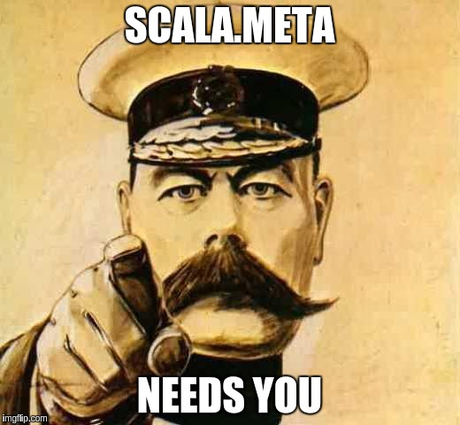

# ScalaSphere 2016 - few impressions from tooling developer

## Scalasphere: conference focused on technical problems and solutions

ScalaSphere was one-of-a-kind conference focused completely on Scala tooling. Those who expected presentations full of theory or math might feel disappointed - conference was deeply technical and practical. "I've never been on such deeply technical conference" was often heard and I agree with those comments.

## Quo vadis, Scala tooling?

After Eugene's presentations at ScalaDays in [Berlin](http://scalamacros.org/paperstalks/2014-06-17-EasyMetaprogrammingForEveryone.pdf) and [Amsterdam](https://www.parleys.com/tutorial/state-meta-summer-2015) we put high hopes in scala.meta. Scala meta was presnted as API over scala AST desiged to reuse library/plugins/macros between scala versions or platforms. I know that some tooling developers started making plans like _"when we have scala.meta then we can ..."_.

The only problem is that Eugene cannot make it work with current scala AST what makes usages really limited. We can operate on AST but we lack information about types. We can modify AST (and this is relatively simple) but it won't be reflected in generated bytecode.

Eugene asked for help and inspiration, so:

## SBT, the only choice

Everybody uses SBT, most complains about it but no one really knows it well. This is a sad true about build tools for scala.

We probably cannot make sbt's internals simpler but we can fix DSL and dependencies resolution (both of wich generated most complaints).
Alexander [presented](http://scalasphere.org/speaker/alexandre-archambault/) his [coursier project](https://github.com/alexarchambault/coursier) addressing the secon problem but we are still waiting for solution for sbt's DSL...

_..or another build tool for scala_

## IDEless or almost IDEless as alternative for "heavy" IDEs?

Sam and Rory gives great talk about progress done in [ensime](http://ensime.github.io/) - project that transforms you favourite editor (I am no more forced to use emacs!) into light IDE . [Dave presented ideas](http://scalasphere.org/speaker/dave-gurnell) that was even more redical about 'IDElessness' - and he claimed they work.

A year back I couldn't imagine developing Scala code without IDE. Today I am starting to belive that it is possible to effectively work on big Scala projects outside IntelliJ or ScalaIDE.

## ScalaIDE, now we know why...

[Iulian](http://scalasphere.org/speaker/iulian-dragos/) opened conference with his talks about beginnings and history of ScalaIDE. I finally heard explanation for many wierd choices back in those days (like waeving inside Java model instead of creating new Scala one). This talk was a big warning to all tooling creators about dangers behind 'let's hack this and we got that for free' approach.
