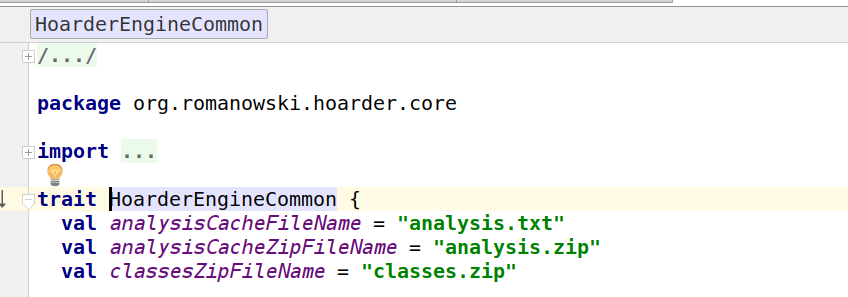

# Zinc (sbt) friendly code

In April I gave a [presentation (50 shades of scala compiler)](https://www.youtube.com/watch?v=enKRadKqEnw) on ScalaUA conference.  In abstract I had promised to give some hints how to write code to be friendly for given compilers. The talk lasted only only 40 minutes and Scala compilers have many, many shades (I almost forgot about dotty!) so hints didn't fit into the slides.

I don't like false promises so you can find first batch of hints (related to incremental compiler) below.  

## TL;DR;

If tools and their internals are boring here is condensed list of my advices. All points are explained below.

 1. [Don't put than one class/trait (and its companion object) in one source file.](#less-is-more)
 2. [Make your packages small (5-7 sources at most).](#less-is-more)
 3. [Add explicit return type for all your public (or even all non-private) methods so they are not changed where is no such need.](#types-we-need-more-types)
 3. [Make sure that your code is and will be free of unused imports.](#unused-ones)
 4. [Don't use wildcard imports from packages that often change. Use wildcards only if you must.](#wildards)
 5. [Don't mix implicits and regular public methods in one class.](#implicits)
 6. [Macros are zinc-killers. Keep them separated and try not to recompile them too often.](#macros)


## Don't use names if you don't need them

Zinc (by default since sbt 0.13 version) use name hashing algorithm.

Let's consider following code:

```scala
//Foo.scala
object Foo {
  val foo = 123
  val bar = 345 // change `345` later to `false`
}

//Bar.scala
class Bar(id: Int = Foo.foo)
```

If `Bar.scala` depends on `foo` from `Foo.scala` than changing `bar` in `Foo.scala` will not make `Bar.scala` to be recompiled (even that `Bar` use `Foo`).

How zinc knows that?

It is all about names and hashes. Zinc computes a hashes for each name defined in your class. Hash is generated from types of all members with given name such as methods, values, types, nested classes etc. On the other side zinc keeps track of all names used in your class (names of method, values, classes, types and much more).
To decide if given class needs to be recompiled we only need to check if any of used name change since last compilation.

This makes zinc much faster in terms of files recompiled for given a change (less is recompiled so compilation is faster) but also introduce new problems.

Generally next sections are focused on reducing number of used names to speed up incremental compilations.

## Less is more

Less classes/traits/objects per source file means more time saved. Scalac can compile nothing less then a whole source. Even if zinc knows that only one-line object needs to be recompiled, still it has to compile whole source (and all implicits macros and other nasty stuff inside).
The solution is as simple as possible - **split your sources!** If incremental compilation is not enough to convince you, it should also help with compilation time or even result in less conflicts during merges.

## Types, we need more types!

<blockquote class="twitter-tweet" data-lang="en"><p lang="en" dir="ltr">Such a strange feeling after <a href="https://twitter.com/hashtag/groovy?src=hash">#groovy</a> when IDE always knows return type of function... <a href="https://twitter.com/hashtag/scala?src=hash">#scala</a> <a href="https://twitter.com/hashtag/typesafe?src=hash">#typesafe</a></p>&mdash; Arthur Kushka (@Arhelmus) <a href="https://twitter.com/Arhelmus/status/500748093222961152">August 16, 2014</a></blockquote>
<script async src="//platform.twitter.com/widgets.js" charset="utf-8"></script>

If you don't provide explicit type, scalac will infer one for you. It will be as precise as possible. Developers love that but later on complain that compilations (even incremental ones) are long. What is the problem with methods without explicit types?  The precise type generated by scalac changes (sometimes often), even without us wanted that. Need an example? Here it goes:

```scala
object ClassesProvider {
	def javaClasses: Array[String] = // Call some Java compiler things
	def scalaClasses: Seq[String] = // Call some Scala compiler things


	def allClasses = javaClasses ++ scalaClasses // of type: Array[String]
	// When we for some reason remove java classes...
	def allClasses = scalaClasses // of type: Seq[String]
	// ...then type is changed and ClassConsumer gets recompiled (but probably it shouldn't)

	// However if we add a return type we can play safely with body
	def allClasses: Seq[String] = javaClasses ++ scalaClasses
}

object ClassConsumer {
	ClassesProvider.allClasses.foreach(print _) // Or maybe do something more clever
}
```

You may say that everything is fine as long as your code compiles. I agree if you don't care how much compilation lasts. Every time type is changed all usages need to be recompiled (and with incremental compiler heuristic even more).

In short words, add return types to all public (or even all non-private) methods.

Do you want a prove on compilation time? Adding return types to public decreased compilation time in Intellij Scala plugin by 17% ([PR](https://github.com/JetBrains/intellij-scala/commit/5b61302e6d11375ace2972a570b2200efe508437)).  

## Imports, wildcards and other nastiness

Most of us don't care about imports. We only need them for code to compile. Even Intellij collapses imports by default:



Let me show that if you care about your build performance (leaving maintenance concerns for another blog post) correct handling of imports is crucial.

### Unused ones

You may reason that unused imports affect scalac performance (e.g. more implicits to check). Regardless compilation benefits it really affects incremental compilation performance. Even if given import is not used at this moment, once changed (the thing behind import, e.g. object), it may affect current file (e.g. providing new implicit that will be used instead of lower priority one).

```scala

// Foo.scala
import lib.RicherString // unused import

class Foo {
  "Ala".head
}

// lib/package.scala
package object lib {
  // When we make RicherString implicit class Foo won't compile
  class RicherString(base: String) {
    val head: Char = if(base.isEmpty) ' ' else base.charAt(0)
  }
}
```

 Luckily, removing unused imports is quite easy. The simplest solution is to add `-Ywarn-unused-import` flag to the compiler and `-Yfatal-warnings` on PR validation builds. With that you will be notified for every build that have unused imports. Those warnings become error on CI forcing you to clean them up before PR is merged.

 Why not set `-Yfatal-warnings` for all builds? Being forced to comment out imports when you just want check if e.g. using `Vector` will make your code faster is really annoying in the longer term.

 ### Wildards

As a tooling developer I should say `don't use wildcards at all!`. I can't (and don't want to) since most of fantastic scala libraries start with `import fantastic.lib._`.

Why are wildcard imports so hard for incremental compiler? Fist step to understand evilness is simple test. Replace any of wildcard import in your code with all members of that package. Later compile the code with '-Ywarn-unused-import'. I wish there is a compiler flag that would tell you how much imports from given wildcard is used :smile:.

This is only the tip of the iceberg. With wildcard imports incremental compiler needs to become ahead of time. Why?
Since you not only import all names that exist at the moment of compilation but you also import all that will exist in future in that package. For incremental compiler old python joke `import jetboard from the.future` has new, bitter taste.

What can we do then? There is no silver bullet here but I can give you some hints:

1 Make you packages (or generally import scopes) small. If your package has 5 sources instead of 20 it will make yours code much, much easier to learn.
2 Make more use of `private` or `private[your_package]` keywords. I really wish everything is Scala was private by default :smile:.
3 Use wildcard imports only from libraries (or pieces of code that is changed rarely). Wildcards are dangerous only when imported things change.

## Implicits

Implicits are probably the hardest part of Scala from incremental compiler perspective. To support implicits effectively and correctly we would need to add relation to *all potential members* of implicit scope. How much connections is that? Way to much to effectively handle them all :smile:.

That is why zinc has to use simpler approach for handling implicits. In short, if you use anything from class `Foo` and *any* implicit name from it changes then our source is recompiled.

What does it mean? If you want smooth and incremental compilation, don't mix implicits and normal code in a single class. Unless you are fine with tons of sources recompiled for no reason!

## Macros

The only way how macros can be supported in incremental compiler is naive brute-force: if a macro is recompiled then all places where this macro is used are also recompiled. It sometimes means that macros are responsible for some of the longest incremental compilations. How can we live with that? Either take incremental compilation of macros in your own hands and turn `recompileOnMacroDef` flag off (in sbt/zinc) or try to remove all cases when macros are recompiled. How to do so?
First of all place macros in dedicated files (containing only macro definitions) and clean up imports. Generally reduce things imported and used in sources containing macros.

## Future reading

If you find incremental compilation interesting you can learn more from links below.

 * [Lightbend blogpost about Zinc](https://www.lightbend.com/blog/zinc-and-incremental-compilation)
 * [Understanding Incremental Recompilation](http://www.scala-sbt.org/0.13/docs/Understanding-Recompilation.html)
 * [Zinc github repository](https://github.com/sbt/zinc)
 * [Hoarder](https://github.com/romanowski/hoarder) - sbt plugin to leverage incremtal compilation e.g. CI jobs
 * [PR: Class-based dependency tracking in name hashing ](https://github.com/sbt/sbt/issues/1104#issuecomment-193002190)
 * [Intellij and sbt incremental compilers comparison (quite old)](https://blog.jetbrains.com/scala/2014/01/30/try-faster-scala-compiler-in-intellij-idea-13-0-2/)
 * [My talk about incremental compiler](https://www.youtube.com/watch?v=7eQ-8f6lYOE)
